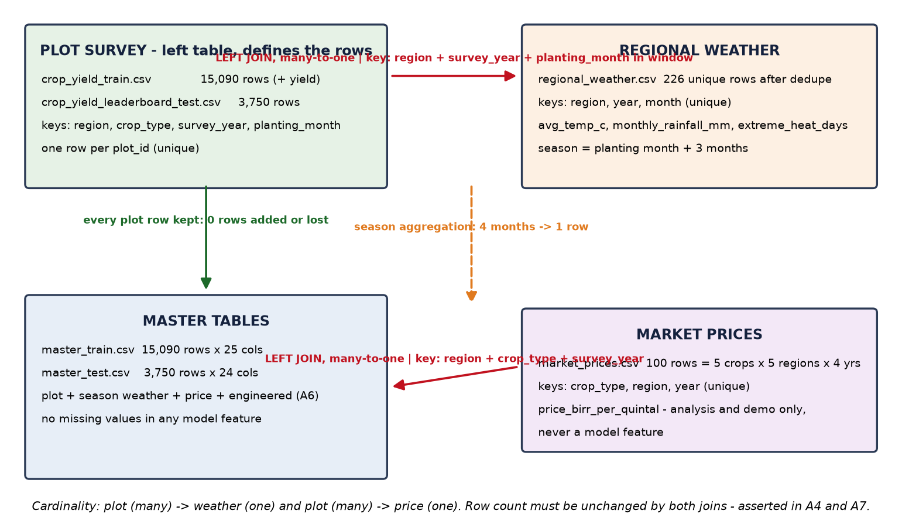

# A - Data Cleaning & Integration Pipeline

**Team Adwa** - Qiyas / IADE Hackathon, Addis Ababa University (5 October 2026)

Generated by `notebooks/01_cleaning_and_integration.ipynb`. Every number below is produced by code
in this project. Raw inputs (never edited): crop_yield_train.csv (15,090 rows),
crop_yield_leaderboard_test.csv (3,750), regional_weather.csv (232), market_prices.csv (100).

## A1 - Cleaning log

| file                            | columns                | issue_type                                                                                      |   rows_affected |   pct_of_rows | fix_applied                                                                                        | why                                                                                                                                                               |
|:--------------------------------|:-----------------------|:------------------------------------------------------------------------------------------------|----------------:|--------------:|:---------------------------------------------------------------------------------------------------|:------------------------------------------------------------------------------------------------------------------------------------------------------------------|
| crop_yield_train.csv            | region                 | inconsistent region labels (upper/lower case, trailing spaces, abbreviations)                   |            2363 |         15.66 | str.strip + case fold + alias map to the canonical label set                                       | region/crop/month are join keys for weather and price; spelling variants would silently drop matches.                                                             |
| crop_yield_train.csv            | crop_type              | inconsistent crop labels (upper/lower case, padded with spaces)                                 |            2982 |         19.76 | str.strip + case fold + alias map to the canonical label set                                       | region/crop/month are join keys for weather and price; spelling variants would silently drop matches.                                                             |
| crop_yield_train.csv            | pest_disease_flag      | missing-value sentinel -999 stored as a real number                                             |             300 |          1.99 | replaced -999 with NaN, then imputed with the train-fitted value                                   | as written -999 would be read as a measurement of -999 and destroy means, correlations and the model.                                                             |
| crop_yield_train.csv            | labor_days_per_ha      | missing-value sentinel -999 stored as a real number                                             |             488 |          3.23 | replaced -999 with NaN, then imputed with the train-fitted value                                   | as written -999 would be read as a measurement of -999 and destroy means, correlations and the model.                                                             |
| crop_yield_train.csv            | rainfall_mm_season     | blank / missing values in the raw export                                                        |             449 |          2.98 | imputed with the train-fitted median (or mode for binary flags)                                    | rows must be kept - the leaderboard scores every test plot, so deleting rows is not an option.                                                                    |
| crop_yield_train.csv            | fertilizer_kg_per_ha   | blank / missing values in the raw export                                                        |             748 |          4.96 | imputed with the train-fitted median (or mode for binary flags)                                    | rows must be kept - the leaderboard scores every test plot, so deleting rows is not an option.                                                                    |
| crop_yield_train.csv            | soil_quality_index     | blank / missing values in the raw export                                                        |             608 |          4.03 | imputed with the train-fitted median (or mode for binary flags)                                    | rows must be kept - the leaderboard scores every test plot, so deleting rows is not an option.                                                                    |
| crop_yield_train.csv            | rainfall_mm_season     | implausible extreme value (heavy tail)                                                          |              74 |          0.49 | capped at the train 99.5% quantile = 1485.64                                                       | a handful of 3,800 mm / 900 kg/ha / 60 ha reports are survey errors; capping keeps the row (we must predict every plot) while stopping it from dominating splits. |
| crop_yield_train.csv            | farm_size_ha           | implausible extreme value (heavy tail)                                                          |              76 |          0.5  | capped at the train 99.5% quantile = 5.44                                                          | a handful of 3,800 mm / 900 kg/ha / 60 ha reports are survey errors; capping keeps the row (we must predict every plot) while stopping it from dominating splits. |
| crop_yield_train.csv            | fertilizer_kg_per_ha   | implausible extreme value (heavy tail)                                                          |              72 |          0.48 | capped at the train 99.5% quantile = 163.28                                                        | a handful of 3,800 mm / 900 kg/ha / 60 ha reports are survey errors; capping keeps the row (we must predict every plot) while stopping it from dominating splits. |
| crop_yield_train.csv            | labor_days_per_ha      | implausible extreme value (heavy tail)                                                          |              74 |          0.49 | capped at the train 99.5% quantile = 83.98                                                         | a handful of 3,800 mm / 900 kg/ha / 60 ha reports are survey errors; capping keeps the row (we must predict every plot) while stopping it from dominating splits. |
| crop_yield_train.csv            | distance_to_market_km  | implausible extreme value (heavy tail)                                                          |              76 |          0.5  | capped at the train 99.5% quantile = 62.66                                                         | a handful of 3,800 mm / 900 kg/ha / 60 ha reports are survey errors; capping keeps the row (we must predict every plot) while stopping it from dominating splits. |
| crop_yield_leaderboard_test.csv | region                 | inconsistent region labels (upper/lower case, trailing spaces, abbreviations)                   |             554 |         14.77 | str.strip + case fold + alias map to the canonical label set                                       | region/crop/month are join keys for weather and price; spelling variants would silently drop matches.                                                             |
| crop_yield_leaderboard_test.csv | crop_type              | inconsistent crop labels (upper/lower case, padded with spaces)                                 |             755 |         20.13 | str.strip + case fold + alias map to the canonical label set                                       | region/crop/month are join keys for weather and price; spelling variants would silently drop matches.                                                             |
| crop_yield_leaderboard_test.csv | pest_disease_flag      | missing-value sentinel -999 stored as a real number                                             |              80 |          2.13 | replaced -999 with NaN, then imputed with the train-fitted value                                   | as written -999 would be read as a measurement of -999 and destroy means, correlations and the model.                                                             |
| crop_yield_leaderboard_test.csv | labor_days_per_ha      | missing-value sentinel -999 stored as a real number                                             |             100 |          2.67 | replaced -999 with NaN, then imputed with the train-fitted value                                   | as written -999 would be read as a measurement of -999 and destroy means, correlations and the model.                                                             |
| crop_yield_leaderboard_test.csv | rainfall_mm_season     | blank / missing values in the raw export                                                        |             125 |          3.33 | imputed with the train-fitted median (or mode for binary flags)                                    | rows must be kept - the leaderboard scores every test plot, so deleting rows is not an option.                                                                    |
| crop_yield_leaderboard_test.csv | fertilizer_kg_per_ha   | blank / missing values in the raw export                                                        |             189 |          5.04 | imputed with the train-fitted median (or mode for binary flags)                                    | rows must be kept - the leaderboard scores every test plot, so deleting rows is not an option.                                                                    |
| crop_yield_leaderboard_test.csv | soil_quality_index     | blank / missing values in the raw export                                                        |             125 |          3.33 | imputed with the train-fitted median (or mode for binary flags)                                    | rows must be kept - the leaderboard scores every test plot, so deleting rows is not an option.                                                                    |
| crop_yield_leaderboard_test.csv | rainfall_mm_season     | implausible extreme value (heavy tail)                                                          |              13 |          0.35 | capped at the train 99.5% quantile = 1485.64                                                       | a handful of 3,800 mm / 900 kg/ha / 60 ha reports are survey errors; capping keeps the row (we must predict every plot) while stopping it from dominating splits. |
| crop_yield_leaderboard_test.csv | farm_size_ha           | implausible extreme value (heavy tail)                                                          |              19 |          0.51 | capped at the train 99.5% quantile = 5.44                                                          | a handful of 3,800 mm / 900 kg/ha / 60 ha reports are survey errors; capping keeps the row (we must predict every plot) while stopping it from dominating splits. |
| crop_yield_leaderboard_test.csv | fertilizer_kg_per_ha   | implausible extreme value (heavy tail)                                                          |              12 |          0.32 | capped at the train 99.5% quantile = 163.28                                                        | a handful of 3,800 mm / 900 kg/ha / 60 ha reports are survey errors; capping keeps the row (we must predict every plot) while stopping it from dominating splits. |
| crop_yield_leaderboard_test.csv | labor_days_per_ha      | implausible extreme value (heavy tail)                                                          |              16 |          0.43 | capped at the train 99.5% quantile = 83.98                                                         | a handful of 3,800 mm / 900 kg/ha / 60 ha reports are survey errors; capping keeps the row (we must predict every plot) while stopping it from dominating splits. |
| crop_yield_leaderboard_test.csv | distance_to_market_km  | implausible extreme value (heavy tail)                                                          |              22 |          0.59 | capped at the train 99.5% quantile = 62.66                                                         | a handful of 3,800 mm / 900 kg/ha / 60 ha reports are survey errors; capping keeps the row (we must predict every plot) while stopping it from dominating splits. |
| regional_weather.csv            | region                 | inconsistent region labels (case, trailing spaces, 3-letter abbreviations such as AMH/ORO/SNNP) |              50 |         21.55 | alias map to the canonical 5 region names                                                          | the weather join keys on region; unmapped labels would silently lose a whole region's weather.                                                                    |
| regional_weather.csv            | region, year, month    | duplicate key rows (same region-year-month reported twice with slightly different values)       |              12 |          5.17 | averaged the duplicate readings, removing 6 rows; key is now unique                                | a many-to-one join from plot to weather would have duplicated plots and inflated the row count if left in.                                                        |
| regional_weather.csv            | avg_temp_c             | missing monthly reading                                                                         |               1 |          0.43 | filled with that region's month climatology (mean over the available years of the same table)      | every region-year-month must exist so growing-season aggregates are comparable across plots.                                                                      |
| regional_weather.csv            | monthly_rainfall_mm    | missing monthly reading                                                                         |               2 |          0.86 | filled with that region's month climatology (mean over the available years of the same table)      | every region-year-month must exist so growing-season aggregates are comparable across plots.                                                                      |
| market_prices.csv               | crop_type              | inconsistent crop labels (upper/lower case, padded)                                             |              22 |         22    | str.strip + case fold to the canonical 5 crop labels                                               | crop_type is a join key with the plot table; variants would break the price merge for those rows.                                                                 |
| market_prices.csv               | price_birr_per_quintal | unit mix-up: price recorded in birr per kg (~34-49) instead of birr per quintal (~3,400-4,900)  |               4 |          4    | multiplied by 100 (1 quintal = 100 kg)                                                             | as recorded these rows would understate revenue 100-fold and break every price trend in the analysis.                                                             |
| market_prices.csv               | price_birr_per_quintal | missing price                                                                                   |               4 |          4    | filled with the mean of the other years for the same crop x region (falling back to the crop mean) | revenue per hectare and the demo need a price for every crop-region-year combination.                                                                             |

**Statistics fit on the train file only and applied unchanged to the test file (Rule 6):**

| group       | column                |    value | used_for                                         |
|:------------|:----------------------|---------:|:-------------------------------------------------|
| imputation  | rainfall_mm_season    |  848.764 | blank / -999 values in train and test            |
| imputation  | fertilizer_kg_per_ha  |   33.827 | blank / -999 values in train and test            |
| imputation  | soil_quality_index    |    0.565 | blank / -999 values in train and test            |
| imputation  | labor_days_per_ha     |   45.035 | blank / -999 values in train and test            |
| imputation  | pest_disease_flag     |    0     | mode of a binary flag                            |
| outlier cap | rainfall_mm_season    | 1485.64  | values above the train 99.5% quantile are capped |
| outlier cap | farm_size_ha          |    5.439 | values above the train 99.5% quantile are capped |
| outlier cap | fertilizer_kg_per_ha  |  163.279 | values above the train 99.5% quantile are capped |
| outlier cap | labor_days_per_ha     |   83.982 | values above the train 99.5% quantile are capped |
| outlier cap | distance_to_market_km |   62.657 | values above the train 99.5% quantile are capped |

31 issue rows over 3 files: plot train 12, plot test 12, weather 4, prices 3 - at least 4 distinct issues in the plot file, 3 in the weather file, 3 in the price file.

## A2 - Key standardisation proof

| table        | column    |   n_before | unique_before                                                                                                                                                                                               |   n_after | unique_after                          | matches_canonical_set   |
|:-------------|:----------|-----------:|:------------------------------------------------------------------------------------------------------------------------------------------------------------------------------------------------------------|----------:|:--------------------------------------|:------------------------|
| plot (train) | region    |         19 | 'AMHARA', 'Amhara', 'Amhara ', 'OROMIA', 'Oromia', 'Oromia ', 'SNNPR', 'SNNPR ', 'SOMALI', 'Somali', 'Somali ', 'TIGRAY', 'Tigray', 'Tigray ', 'amhara', 'oromia', 'snnpr', 'somali', 'tigray'              |         5 | Amhara, Oromia, SNNPR, Somali, Tigray | yes                     |
| plot (test)  | region    |         19 | 'AMHARA', 'Amhara', 'Amhara ', 'OROMIA', 'Oromia', 'Oromia ', 'SNNPR', 'SNNPR ', 'SOMALI', 'Somali', 'Somali ', 'TIGRAY', 'Tigray', 'Tigray ', 'amhara', 'oromia', 'snnpr', 'somali', 'tigray'              |         5 | Amhara, Oromia, SNNPR, Somali, Tigray | yes                     |
| weather      | region    |         20 | 'AMH', 'Amhara', 'Amhara ', 'ORO', 'Oromia', 'Oromia ', 'SNNP', 'SNNPR', 'SNNPR ', 'SOM', 'Somali', 'Somali ', 'TIG', 'Tigray', 'Tigray ', 'amhara', 'oromia', 'snnpr', 'somali', 'tigray'                  |         5 | Amhara, Oromia, SNNPR, Somali, Tigray | yes                     |
| price        | region    |          5 | 'Amhara', 'Oromia', 'SNNPR', 'Somali', 'Tigray'                                                                                                                                                             |         5 | Amhara, Oromia, SNNPR, Somali, Tigray | yes                     |
| plot (train) | crop_type |         21 | ' barley ', ' maize ', ' sorghum ', ' teff ', ' wheat ', 'BARLEY', 'Barley', 'MAIZE', 'Maize', 'SORGHUM', 'Sorghum', 'TEFF', 'Tef', 'Teff', 'WHEAT', 'Wheat', 'barley', 'maize', 'sorghum', 'teff', 'wheat' |         5 | barley, maize, sorghum, teff, wheat   | yes                     |
| plot (test)  | crop_type |         21 | ' barley ', ' maize ', ' sorghum ', ' teff ', ' wheat ', 'BARLEY', 'Barley', 'MAIZE', 'Maize', 'SORGHUM', 'Sorghum', 'TEFF', 'Tef', 'Teff', 'WHEAT', 'Wheat', 'barley', 'maize', 'sorghum', 'teff', 'wheat' |         5 | barley, maize, sorghum, teff, wheat   | yes                     |
| price        | crop_type |         14 | ' barley ', ' maize ', ' sorghum ', ' teff ', ' wheat ', 'Barley', 'Maize', 'Sorghum', 'Wheat', 'barley', 'maize', 'sorghum', 'teff', 'wheat'                                                               |         5 | barley, maize, sorghum, teff, wheat   | yes                     |

Assertions printed by the notebook: region labels are identical across plot train, plot test, weather and price tables; crop labels are identical across plot train, plot test and price tables.

## A3 - Join map & diagram

- **Growing-season window:** planting month + the following three months (rolls into the next
  calendar year if needed). Monthly weather is aggregated to one row per
  `(region, survey_year, planting_month)` before any plot joins it.
- **plot -> weather:** LEFT join on `region + survey_year + planting_month`, many-to-one.
- **plot -> price:** LEFT join on `region + crop_type + survey_year`, many-to-one.
- **Why the plot table is the left table:** the leaderboard scores every test plot, so the plot
  table defines the row set; weather and price are attributes of a plot's region-year and can only
  add columns, never rows.

## A4 - Join audit

| join                                | join key                                               |   rows before |   rows after | row count unchanged   |   match rate % |   unmatched plots | why / handling                                                                                                                                           |
|:------------------------------------|:-------------------------------------------------------|--------------:|-------------:|:----------------------|---------------:|------------------:|:---------------------------------------------------------------------------------------------------------------------------------------------------------|
| plot -> weather (LEFT, many-to-one) | region + survey_year + planting_month in season window |         15090 |        15090 | True                  |            100 |                 0 | 0 unmatched. 2925 plots (19.4%) have <4 observed months; missing months are filled from the region-month climatology and flagged in wx_n_months_observed |
| plot -> weather (LEFT, many-to-one) | region + survey_year + planting_month in season window |          3750 |         3750 | True                  |            100 |                 0 | 0 unmatched. 748 plots (19.9%) have <4 observed months - same handling as train                                                                          |
| plot -> price (LEFT, many-to-one)   | region + crop_type + survey_year                       |         15090 |        15090 | True                  |            100 |                 0 | every crop-region-year key exists in the 100-row price grid; 4 blank prices filled with the crop x region mean                                           |
| plot -> price (LEFT, many-to-one)   | region + crop_type + survey_year                       |          3750 |         3750 | True                  |            100 |                 0 | all keys matched; blank prices filled exactly as for train                                                                                               |

- Row counts: train 15,090 -> 15,090 -> 15,090; test 3,750 ->
  3,750 -> 3,750. Unchanged by both joins; `validate="many_to_one"` is asserted
  inside the join helpers, so a duplicate key raises instead of silently duplicating plots.
- Duplicate weather keys before the join: 6 duplicated rows over
  6 keys - averaged away, leaving 0.
- Season coverage: train {2: 448, 3: 2477, 4: 12165}, test {2: 113, 3: 635, 4: 3002}. 2,925 train plots
  (19.4%) and 748 test plots (19.9%) have fewer
  than the full four months.
- Handling: missing months are filled from that region's month climatology (mean of the same
  calendar month over the available years) and `wx_n_months_observed` records how many months were
  real, so the model can discount partly-imputed seasons.
- Unmatched plots: weather 0 / 0 and price 0 / 0. 4 blank prices were filled with the
  crop x region mean.

## A5 - Join proof (3 plots)

For each plot the notebook prints its four window months, the weather rows pulled (or the climatology used when a month is missing), the hand-computed season aggregates and the stored master values. Plots proven: `PLOT-007457`, `PLOT-000339`, `PLOT-006092` - all MATCH.

## A6 - Feature engineering table

| feature                 | type           | formula                                                                    | source columns                                                       | why we expect it to help                                                                 |
|:------------------------|:---------------|:---------------------------------------------------------------------------|:---------------------------------------------------------------------|:-----------------------------------------------------------------------------------------|
| wx_season_mean_temp_c   | weather        | mean(avg_temp_c) over planting month + 3 months                            | regional_weather.avg_temp_c + plot region/survey_year/planting_month | every crop has a temperature optimum and the plot table has no temperature at all        |
| wx_season_rain_total_mm | weather        | sum(monthly_rainfall_mm) over the same 4 months                            | regional_weather.monthly_rainfall_mm                                 | station rainfall is measured, while the plot's own rainfall is self-reported and noisy   |
| wx_extreme_heat_days    | weather        | sum(extreme_heat_days) over the window                                     | regional_weather.extreme_heat_days                                   | heat spikes during flowering cut yields, especially maize and teff                       |
| wx_temp_anomaly_c       | weather        | season mean temp - the region's own typical temp for those calendar months | regional_weather.avg_temp_c                                          | an unusually hot year in a hot region is what hurts, not the absolute level              |
| wx_n_months_observed    | weather        | count of window months present in the weather table (0-4)                  | weather key presence                                                 | flags seasons built partly from climatology so the model can discount them               |
| rain_gap_mm             | weather + plot | rainfall_mm_season - wx_season_rain_total_mm                               | plot rainfall_mm_season, weather aggregate                           | farmer-reported vs station-measured disagreement marks atypical or misreported plots     |
| fert_x_seed             | interaction    | fertilizer_kg_per_ha * improved_seed_used                                  | fertilizer_kg_per_ha, improved_seed_used                             | fertilizer pays off mainly with improved seed - an additive model cannot express that    |
| planting_month_num      | planting month | planting_month mapped to 1-12                                              | planting_month                                                       | timing moves the season into different rainfall and heat regimes; gives an ordered month |
Six of the eight features come from the weather table (Rule 5); `fert_x_seed` is the interaction and `planting_month_num` comes from planting_month.

## A7 - Integrity checks

|   # | check                                                        | result   | detail                                            |
|----:|:-------------------------------------------------------------|:---------|:--------------------------------------------------|
|   1 | plot_id is unique in master_train                            | PASS     | n=15090                                           |
|   2 | plot_id is unique in master_test                             | PASS     | n=3750                                            |
|   3 | row count unchanged by the joins (train)                     | PASS     | 15090 -> 15090                                    |
|   4 | row count unchanged by the joins (test)                      | PASS     | 3750 -> 3750                                      |
|   5 | no missing values in model features (train)                  | PASS     | NaNs=0                                            |
|   6 | no missing values in model features (test)                   | PASS     | NaNs=0                                            |
|   7 | region labels within the allowed set (all 3 files)           | PASS     | ['Amhara', 'Oromia', 'SNNPR', 'Somali', 'Tigray'] |
|   8 | crop labels within the allowed set (plot + price)            | PASS     | ['barley', 'maize', 'sorghum', 'teff', 'wheat']   |
|   9 | train and test share the same feature columns (minus target) | PASS     | 24 cols                                           |
|  10 | yield >= 0 (train target)                                    | PASS     | min=0.100                                         |
|  11 | price > 0 in both masters                                    | PASS     | min=2403.0                                        |
|  12 | soil_quality_index inside [0, 1]                             | PASS     |                                                   |
|  13 | weather key (region, year, month) unique after cleaning      | PASS     | rows=226                                          |
|  14 | price key (crop, region, year) unique after cleaning         | PASS     | rows=100                                          |
|  15 | no -999 sentinels left in either master                      | PASS     |                                                   |
|  16 | price is NOT a model feature (analysis only)                 | PASS     |                                                   |
|  17 | at least one weather-derived feature is used (Rule 5)        | PASS     | 6 weather features in the model                   |
**17/17 checks PASS.** The notebook prints one PASS/FAIL line per check.

## A8 - Master tables & data dictionary

| file | rows | columns |
|---|---|---|
| data/processed/master_train.csv | 15,090 | 25 |
| data/processed/master_test.csv | 3,750 | 24 |
| data/processed/data_dictionary_master.csv | 25 | 6 |
master_test has exactly the master_train columns minus the target. Label repair is deterministic; imputation values and outlier caps are fit on the train file only and then applied to test, so nothing is learned from the test data (Rule 6).
| column                  | dtype   | source_file                             | description                                                                | derivation                                                                                | used_as_model_feature     |
|:------------------------|:--------|:----------------------------------------|:---------------------------------------------------------------------------|:------------------------------------------------------------------------------------------|:--------------------------|
| plot_id                 | str     | crop_yield_*.csv                        | Unique plot ID / join key for scoring                                      | as given                                                                                  | no                        |
| region                  | object  | crop_yield_*.csv + regional_weather.csv | Ethiopian region of the plot                                               | label standardisation (alias map)                                                         | yes                       |
| crop_type               | string  | crop_yield_*.csv + market_prices.csv    | Crop grown                                                                 | label standardisation (alias map)                                                         | yes                       |
| survey_year             | int64   | crop_yield_*.csv                        | Survey / season year 2021-2024                                             | as given, integer                                                                         | yes                       |
| planting_month          | object  | crop_yield_*.csv                        | Month the crop was planted                                                 | label standardisation                                                                     | yes                       |
| altitude_m              | float64 | crop_yield_*.csv                        | Plot elevation, metres above sea level                                     | as given                                                                                  | yes                       |
| rainfall_mm_season      | float64 | crop_yield_*.csv                        | Plot self-reported growing-season rainfall, mm                             | median-imputed (train median); capped at train p99.5                                      | yes                       |
| farm_size_ha            | float64 | crop_yield_*.csv                        | Farm size, hectares                                                        | capped at train p99.5                                                                     | yes                       |
| fertilizer_kg_per_ha    | float64 | crop_yield_*.csv                        | Fertilizer applied, kg/ha                                                  | median-imputed; capped at train p99.5                                                     | yes                       |
| improved_seed_used      | int64   | crop_yield_*.csv                        | Certified improved seed (0/1)                                              | as given, integer                                                                         | yes                       |
| pest_disease_flag       | int64   | crop_yield_*.csv                        | Pest/disease pressure (0/1)                                                | -999 sentinel -> missing -> train mode                                                    | yes                       |
| soil_quality_index      | float64 | crop_yield_*.csv                        | Composite soil quality (0-1)                                               | median-imputed                                                                            | yes                       |
| labor_days_per_ha       | float64 | crop_yield_*.csv                        | Labor-days per hectare                                                     | -999 sentinel -> missing -> train median; capped at train p99.5                           | yes                       |
| distance_to_market_km   | float64 | crop_yield_*.csv                        | Distance to nearest market, km                                             | capped at train p99.5                                                                     | yes                       |
| wx_season_mean_temp_c   | float64 | regional_weather.csv                    | Mean temperature over the growing-season window, degC                      | mean of planting month + 3 following months for the plot's region/year                    | yes (weather)             |
| wx_season_rain_total_mm | float64 | regional_weather.csv                    | Station rainfall total over the growing-season window, mm                  | sum of the same 4 monthly readings                                                        | yes (weather)             |
| wx_extreme_heat_days    | int64   | regional_weather.csv                    | Extreme-heat days during the window                                        | sum of extreme_heat_days over the 4 window months                                         | yes (weather)             |
| wx_n_months_observed    | int64   | regional_weather.csv                    | How many of the 4 window months exist in the raw weather table (0-4)       | count of observed cells before climatology filling                                        | yes (weather)             |
| wx_temp_anomaly_c       | float64 | regional_weather.csv                    | Window temperature minus the region's own typical window temperature, degC | wx_season_mean_temp_c - mean of the same calendar months for that region across all years | yes (weather)             |
| wx_rain_anomaly_mm      | float64 | regional_weather.csv                    | Window rainfall minus the region's typical window rainfall, mm             | wx_season_rain_total_mm - regional climatology for those months                           | no (reported in analysis) |
| price_birr_per_quintal  | float64 | market_prices.csv                       | Market price, birr per quintal (ANALYSIS ONLY - never a model feature)     | unit-corrected (x100 where recorded per kg) + missing filled                              | no                        |
| planting_month_num      | int64   | crop_yield_*.csv                        | Planting month as 1-12 ordinal                                             | map from planting_month                                                                   | yes                       |
| fert_x_seed             | float64 | crop_yield_*.csv                        | Interaction: fertilizer x improved seed                                    | fertilizer_kg_per_ha * improved_seed_used                                                 | yes                       |
| rain_gap_mm             | float64 | crop_yield_*.csv + regional_weather.csv | Plot-reported rainfall minus station season rainfall, mm                   | rainfall_mm_season - wx_season_rain_total_mm                                              | yes (weather)             |
| yield_tons_per_ha       | float64 | crop_yield_train.csv                    | TRUE yield, tons per hectare (train only)                                  | as given (target)                                                                         | target                    |
